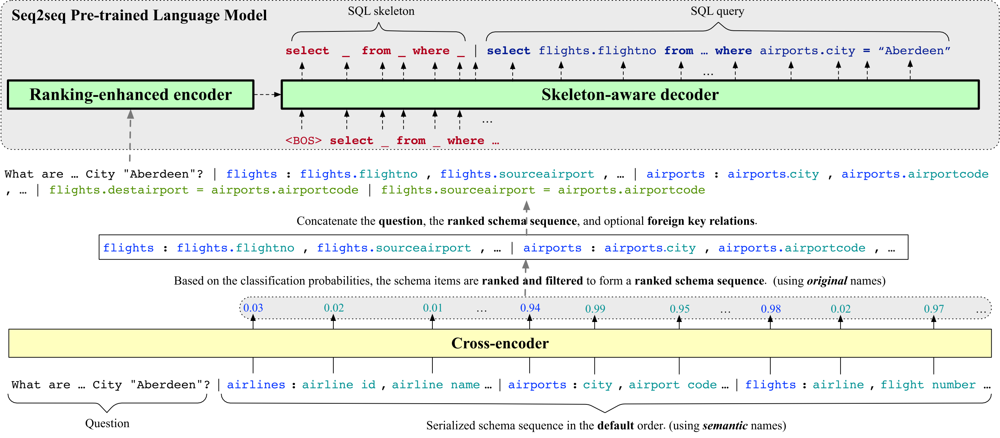

<p align="left">
    <br>
    
    <br>
<p>

# RESDSQL: Decoupling Schema Linking and Skeleton Parsing for Text-to-SQL
This is the official implementation of the paper "RESDSQL: Decoupling Schema Linking and Skeleton Parsing for Text-to-SQL" (AAAI 2023).

If this repository could help you, please cite the following paper:
```
@inproceedings{li2022resdsql,
  author = {Haoyang Li and Jing Zhang and Cuiping Li and Hong Chen},
  title = "RESDSQL: Decoupling Schema Linking and Skeleton Parsing for Text-to-SQL",
  booktitle = "AAAI",
  year = "2023"
}
```

`Update (2023.3.13):` We evaluated our method on a diagnostic evaluation benchmark, [Dr.Spider](https://github.com/awslabs/diagnostic-robustness-text-to-sql), which contains 17 test sets to measure the robustness of Text-to-SQL parsers under different perturbation perspectives.

`Update (2023.5.19):` We added support for [CSpider](https://taolusi.github.io/CSpider-explorer/), a Chinese Text-to-SQL benchmark with Chinese questions, English database schema, and corresponding SQL queries.

`Update (2023.11.1):` We are excited to present our text-to-SQL demo, available at https://github.com/RUCKBReasoning/text2sql-demo. This demo showcases the capabilities of our newly developed pre-trained language model CodeS, which has been specifically tailored for text-to-SQL tasks. Additionally, we have included comprehensive instructions on how to build the demo using your databases. We encourage you to experiment with it and explore its features! 🔥

`Update (2024.4.12):` We are thrilled to announce that our latest work, CodeS, has been accepted by SIGMOD 2024. CodeS represents a significant advancement over RESDSQL, incorporating a more powerful language model. We also re-developed the schema filter to make it easy to use. For an in-depth look at CodeS, please consult our paper available at [CodeS-paper](https://arxiv.org/abs/2402.16347). Additionally, we have made the source code publicly available at [CodeS-code](https://github.com/RUCKBReasoning/codes) for community use and feedback.

`Update (2024.4.19):` We are excited to announce the release of our newly developed schema filter, boasting 3 billion parameters and offering bilingual support for both Chinese and English. This tool is now available as an independent component and can be accessed at [text2sql-schema-filter](https://github.com/RUCKBReasoning/text2sql-schema-filter). If you're looking to enhance your text-to-SQL system with a schema filter, we encourage you to give it a try. 

## Overview
We introduce a new Text-to-SQL parser, **RESDSQL** (**R**anking-enhanced **E**ncoding plus a **S**keleton-aware **D**ecoding framework for Text-to-**SQL**), which attempts to decoulpe the schema linking and the skeleton parsing to reduce the difficulty of Text-to-SQL. More details can be found in our [paper](https://arxiv.org/abs/2302.05965). All experiments are conducted on a single NVIDIA A100 80G GPU.

## Evaluation Results
We evaluate RESDSQL on six benchmarks: Spider, Spider-DK, Spider-Syn, Spider-Realistic, Dr.Spider, and CSpider. We adopt two metrics: Exact-set-Match accuracy (EM) and EXecution accuracy (EX). Let's look at the following numbers:

**On Spider:**

| Model | Dev EM | Dev EX | Test EM | Test EX |
|-------|--------|--------|---------|---------|
| RESDSQL-3B+NatSQL | **80.5%** | **84.1%** | **72.0%** | **79.9%** |
| RESDSQL-3B | 78.0% | 81.8% | - | - |
| RESDSQL-Large+NatSQL | 76.7% | 81.9% | - | - |
| RESDSQL-Large | 75.8% | 80.1% | - | - |
| RESDSQL-Base+NatSQL | 74.1% | 80.2% | - | - |
| RESDSQL-Base | 71.7% | 77.9% | - | - |

**On Spider-DK, Spider-Syn, and Spider-Realistic:**

| Model | DK EM | DK EX | Syn EM | Syn EX | Realistic EM | Realistic EX |
|-------|-------|-------|--------|--------|--------------|--------------|
| RESDSQL-3B+NatSQL| 53.3% | 66.0% | 69.1% | 76.9% | 77.4% | 81.9% |

**On Dr.Spider's perturbation sets:**
Following Dr.Spider, we only report **EX** for each post-perturbation set and choose PICARD and CodeX as our baseline methods.

| Perturbation set | PICARD | CodeX | RESDSQL-3B | RESDSQL-3B+NatSQL |
|------------------|--------|-------|-------------------|-----|
| DB-Schema-synonym | 56.5% | 62.0% | 63.3% | **68.3%** |
| DB-Schema-abbreviation | 64.7% | 68.6% | 64.5% | **70.0%** |
| DB-DBcontent-equivalence | 43.7% | **51.6%** | 40.3% | 40.1% |
| NLQ-Keyword-synonym | 66.3% | 55.5% | 67.5% | **72.4%** |
| NLQ-Keyword-carrier | 82.7% | 85.2% | **86.7%** | 83.5% |
| NLQ-Column-synonym | 57.2% | 54.7% | 57.4% | **63.1%** |
| NLQ-Column-carrier | 64.9% | 51.1% | **69.9%** | 63.9% |
| NLQ-Column-attribute | 56.3% | 46.2% | 58.8% | **71.4%** |
| NLQ-Column-value | 69.4%  | 71.4% | 73.4% | **76.6%** |
| NLQ-Value-synonym | 53.0% | **59.9%** | 53.8% | 53.2% |
| NLQ-Multitype | 57.1%  | 53.7% | 60.1% | **60.7%** |
| NLQ-Others | 78.3% | 69.7% | 77.3% | **79.0%** |
| SQL-Comparison | 68.0% | 66.9% | 70.2% | **82.0%** |
| SQL-Sort-order | 74.5% | 57.8% | 79.7% | **85.4%** |
| SQL-NonDB-number | 77.1% | **89.3%** | 83.2% | 85.5% |
| SQL-DB-text | 65.1% | 72.4% | 67.8% | **74.3%** |
| SQL-DB-number | 85.1% | 79.3% | 85.4% | **88.8%** |
| Average | 65.9% | 64.4% | 68.2% | **71.7%** |

Notice: We also employed the modified test suite script (see this [issue](https://github.com/awslabs/diagnostic-robustness-text-to-sql/issues/1)) to evaluate the model-generated results, but obtained the same numbers as above. Nevertheless, we suggest that further work should use their modified script to evaluate Dr.Spider.

**On CSpider's development set:**
| Model | EM | EXEC | 
| ----- | -- | ---- | 
| RESDSQL-3B+NatSQL | **66.3%** | **81.1%** | 
| RESDSQL-Large+NatSQL | 64.3% | 81.1% | 
| LGESQL + GTL + Electra + QT | 64.0% | - |
| LGESQL + ELECTRA + QT | 64.5% | - |
| RESDSQL-Base+NatSQL | 61.7% | 78.1% | 


## Prerequisites
Create a virtual anaconda environment:
```sh
conda create -n your_env_name python=3.8.5
```
Active it and install the cuda version Pytorch:
```sh
conda install pytorch==1.11.0 torchvision==0.12.0 torchaudio==0.11.0 cudatoolkit=11.3 -c pytorch
```
Install other required modules and tools:
```sh
pip install -r requirements.txt
pip install https://github.com/explosion/spacy-models/releases/download/en_core_web_sm-2.2.0/en_core_web_sm-2.2.0.tar.gz
python nltk_downloader.py
```
Create several folders:
```sh
mkdir eval_results
mkdir models
mkdir tensorboard_log
mkdir third_party
mkdir predictions
```
Clone evaluation scripts:
```sh
cd third_party
git clone https://github.com/ElementAI/spider.git
git clone https://github.com/ElementAI/test-suite-sql-eval.git
mv ./test-suite-sql-eval ./test_suite
cd ..
```

## Prepare data
Download [data](https://drive.google.com/file/d/19tsgBGAxpagULSl9r85IFKIZb4kyBGGu/view?usp=sharing) **(including Spider, Spider-DK, Spider-Syn, Spider-Realistic, Dr.Spider, and CSpider)** and [database](https://drive.google.com/file/d/1s4ItreFlTa8rUdzwVRmUR2Q9AHnxbNjo/view?usp=share_link) and then unzip them:
```sh
unzip data.zip
unzip database.zip
```
Notice: Dr.Spider has been preprocessed following the instructions on its Github page.

## Inference
All evaluation results can be easily reproduced through our released scripts and checkpionts.
### Step1: Prepare Checkpoints
Because RESDSQL is a two-stage algorithm, therefore, you should first download cross-encoder checkpoints. Here are links: 
| Cross-encoder Checkpoints | Google Drive | Baidu Netdisk |
|----------|-----------|--------------|
| text2natsql_schema_item_classifier| [Link](https://drive.google.com/file/d/1UWNj1ZADfKa1G5I4gBYCJeEQO6piMg4G/view?usp=share_link) | [Link](https://pan.baidu.com/s/15eGPMSx7K8oLV4hkjnCzaw) (pwd: 18w8) |
| text2sql_schema_item_classifier | [Link](https://drive.google.com/file/d/1zHAhECq1uGPR9Rt1EDsTai1LbRx0jYIo/view?usp=share_link) | [Link](https://pan.baidu.com/s/1trSi8OBOcPo5NkZb_o-T4g) (pwd: dr62) |
| xlm_roberta_text2natsql_schema_item_classifier (trained on CSpider) | - | [Link](https://pan.baidu.com/s/1oTkuqoU-RWr3QsNC9Y-RpA) (pwd: 3sdu) |

Then, you should download T5 (for Spider) or mT5 (for CSpider) checkpoints: 
| T5/mT5 Checkpoints | Google Drive/OneDrive | Baidu Netdisk |
|-------|-------|-------|
| text2natsql-t5-3b | [OneDrive link](https://1drv.ms/u/s!Ak05bBUBFYiktcdziiE79xaeKtO6qg?e=e9424n) | [Link](https://pan.baidu.com/s/1ReHso0QgX5aT-hGySUnlrQ) (pwd: 4r98) |
| text2sql-t5-3b | [Google Drive link](https://drive.google.com/file/d/1M-zVeB6TKrvcIzaH8vHBIKeWqPn95i11/view?usp=sharing) | [Link](https://pan.baidu.com/s/1mZxakfes4wRSEwnRW43i5A) (pwd: sc62) |
| text2natsql-t5-large | [Google Drive link](https://drive.google.com/file/d/1ZwFsH24_qKC3xwYdedPi6T_8argguWHe/view?usp=sharing) | [Link](https://pan.baidu.com/s/18H8lgnv9gfXmUo_oO_CdOA) (pwd: 7iyq) |
| text2sql-t5-large | [Google Drive link](https://drive.google.com/file/d/1-xwtKwfJZSrmJrU-_Xdkx1kPuZao7r7e/view?usp=sharing) | [Link](https://pan.baidu.com/s/1Mwg0OZZ48APEq9jPvQQNtw) (pwd: q58k) |
| text2natsql-t5-base | [Google Drive link](https://drive.google.com/file/d/1QyfSfHHrxfIM5X9gKUYNr_0ZRVvb1suV/view?usp=share_link) | [Link](https://pan.baidu.com/s/1XegaZFvXuZ_jf3P-9YPQCQ) (pwd: pyxf) |
| text2sql-t5-base | [Google Drive link](https://drive.google.com/file/d/1lqZ81f_fSZtg6BRcRw1-Ol-RJCcKRsmH/view?usp=sharing) | [Link](https://pan.baidu.com/s/1-6H7zStq0WCJHTjDuVspoQ) (pwd: wuek) |
| text2natsql-mt5-xl-cspider (trained on CSpider) | - | [Link](https://pan.baidu.com/s/1tFkGOiw5ETB83-Ct3MuVXA) (pwd: y7ei) |
| text2natsql-mt5-large-cspider (trained on CSpider) | - | [Link](https://pan.baidu.com/s/1LUjL-2nwNfUJhzI3cm7aEQ) (pwd: ydqk) |
| text2natsql-mt5-base-cspider (trained on CSpider) | - | [Link](https://pan.baidu.com/s/1tbEUIBPUTA2Oz7K2lHT9oA) (pwd: d8b8) |

The checkpoints should be placed in the `models` folder. 

For CSpider, we only provide the NatSQL version because its performance is better than SQL in our pre-experiments. To support CSpider, we replace roberta-large with xlm-roberta-large in the first stage and replace t5 with mt5 in the second stage.

### Step2: Run Inference
The inference scripts are located in `scripts/inference`. 
Concretely, `infer_text2natsql.sh` is the inference script of RESDSQL-{Base, Large, 3B}+NatSQL, and `infer_text2sql.sh` is the inference script of RESDSQL-{Base, Large, 3B}. For example, you can run the inference of RESDSQL-3B+NatSQL on Spider's dev set via:
```sh
sh scripts/inference/infer_text2natsql.sh 3b spider
```
The first argument (model scale) can be selected from `[base, large, 3b]` and the second argument (dataset name) can be selected from `[spider, spider-realistic, spider-syn, spider-dk, DB_schema_synonym, DB_schema_abbreviation, DB_DBcontent_equivalence, NLQ_keyword_synonym, NLQ_keyword_carrier, NLQ_column_synonym, NLQ_column_carrier, NLQ_column_attribute, NLQ_column_value, NLQ_value_synonym, NLQ_multitype, NLQ_others, SQL_comparison, SQL_sort_order, SQL_NonDB_number, SQL_DB_text, SQL_DB_number]`.

The predicted SQL queries are recorded in `predictions/{dataset_name}/{model_name}/pred.sql`.

**Inference on CSpider's Dev Set (New Feature)**
We also provide inference scripts to run RESDSQL-{Base, Large, 3B}+NatSQL on CSpider's development set. Here is an example:
```sh
sh scripts/inference/infer_text2natsql_cspider.sh 3b
```
The first argument (model scale) can be selected from `[base, large, 3b]`.

## Training on Spider
We provide scripts in `scripts/train/text2natsql` and `scripts/train/text2sql` to train RESDSQL on Spider's training set and evaluate on Spider's dev set.

**RESDSQL-{Base, Large, 3B}+NatSQL**
```sh
# Step1: preprocess dataset
sh scripts/train/text2natsql/preprocess.sh
# Step2: train cross-encoder
sh scripts/train/text2natsql/train_text2natsql_schema_item_classifier.sh
# Step3: prepare text-to-natsql training and development set for T5
sh scripts/train/text2natsql/generate_text2natsql_dataset.sh
# Step4: fine-tune T5-3B (RESDSQL-3B+NatSQL)
sh scripts/train/text2natsql/train_text2natsql_t5_3b.sh
# Step4: (or) fine-tune T5-Large (RESDSQL-Large+NatSQL)
sh scripts/train/text2natsql/train_text2natsql_t5_large.sh
# Step4: (or) fine-tune T5-Base (RESDSQL-Base+NatSQL)
sh scripts/train/text2natsql/train_text2natsql_t5_base.sh
```

**RESDSQL-{Base, Large, 3B}**
```sh
# Step1: preprocess dataset
sh scripts/train/text2sql/preprocess.sh
# Step2: train cross-encoder
sh scripts/train/text2sql/train_text2sql_schema_item_classifier.sh
# Step3: prepare text-to-sql training and development set for T5
sh scripts/train/text2sql/generate_text2sql_dataset.sh
# Step4: fine-tune T5-3B (RESDSQL-3B)
sh scripts/train/text2sql/train_text2sql_t5_3b.sh
# Step4: (or) fine-tune T5-Large (RESDSQL-Large)
sh scripts/train/text2sql/train_text2sql_t5_large.sh
# Step4: (or) fine-tune T5-Base (RESDSQL-Base)
sh scripts/train/text2sql/train_text2sql_t5_base.sh
```

**During training, the cross-encoder (i.e., the first stage) always keeps the best checkpoint, but T5 (i.e., the second stage) keeps all the intermediate checkpoints, because different test sets may achieve the best Text-to-SQL performance on different checkpoints**. Therefore, given a test set, we need to evaluate all the intermediate checkpoints and compare their performance to find the best checkpoint. The evaluation results of checkpoints are saved in `eval_results`.

Our paper also report the performence of RESDSQL-3B+NatSQL (the most powerful version of RESDSQL) on Spider-DK, Spider-Syn, and Spider-Realistic. To obtain results on these datasets, we provide evaluation scripts in `scripts/evaluate_robustness`. Here is an example for Spider-DK:
```sh
# Step1: preprocess Spider-DK
sh scripts/evaluate_robustness/preprocess_spider_dk.sh
# Step2: Run evaluation on Spider-DK
sh scripts/evaluate_robustness/evaluate_on_spider_dk.sh
```

## Training on CSpider
We additionally provide scripts in `scripts/train/cspider_text2natsql` and `scripts/train/cspider_text2sql` to train RESDSQL on CSpider's training set and evaluate on CSpider's dev set.

**RESDSQL-{Base, Large, 3B}+NatSQL (CSpider version)**
```sh
# Step1: preprocess CSpider
sh scripts/train/cspider_text2natsql/preprocess.sh
# Step2: train cross-encoder
sh scripts/train/cspider_text2natsql/train_text2natsql_schema_item_classifier.sh
# Step3: prepare text-to-natsql training and development set for mT5
sh scripts/train/cspider_text2natsql/generate_text2natsql_dataset.sh
# Step4: fine-tune mT5-XL (RESDSQL-3B+NatSQL)
sh scripts/train/cspider_text2natsql/train_text2natsql_mt5_xl.sh
# Step4: (or) fine-tune mT5-Large (RESDSQL-Large+NatSQL)
sh scripts/train/cspider_text2natsql/train_text2natsql_mt5_large.sh
# Step4: (or) fine-tune mT5-Base (RESDSQL-Base+NatSQL)
sh scripts/train/cspider_text2natsql/train_text2natsql_mt5_base.sh
```

In order to train the NatSQL version on CSpider, we manually aligned and modified annotations of NatSQL. The aligned files are also released, see `NatSQL/NatSQLv1_6/train_cspider-natsql.json` and `NatSQL/NatSQLv1_6/dev_cspider-natsql.json`.

**RESDSQL-{Base, Large, 3B} (CSpider version)**
```sh
# Step1: preprocess CSpider
sh scripts/train/cspider_text2sql/preprocess.sh
# Step2: train cross-encoder
sh scripts/train/cspider_text2sql/train_text2sql_schema_item_classifier.sh
# Step3: prepare text-to-sql training and development set for mT5
sh scripts/train/cspider_text2sql/generate_text2sql_dataset.sh
# Step4: fine-tune mT5-XL (RESDSQL-3B)
sh scripts/train/cspider_text2sql/train_text2sql_mt5_xl.sh
# Step4: (or) fine-tune mT5-Large (RESDSQL-Large)
sh scripts/train/cspider_text2sql/train_text2sql_mt5_large.sh
# Step4: (or) fine-tune mT5-Base (RESDSQL-Base)
sh scripts/train/cspider_text2sql/train_text2sql_mt5_base.sh
```


## Acknowledgements
We would thanks to Hongjin Su and Tao Yu for their help in evaluating our method on Spider's test set. We would also thanks to PICARD ([paper](https://arxiv.org/abs/2109.05093), [code](https://github.com/ServiceNow/picard)), NatSQL ([paper](https://arxiv.org/abs/2109.05153), [code](https://github.com/ygan/NatSQL)), Spider ([paper](https://arxiv.org/abs/1809.08887), [dataset](https://yale-lily.github.io/spider)), Spider-DK ([paper](https://arxiv.org/abs/2109.05157), [dataset](https://github.com/ygan/Spider-DK)), Spider-Syn ([paper](https://arxiv.org/abs/2106.01065), [dataset](https://github.com/ygan/Spider-Syn)), Spider-Realistic ([paper](https://arxiv.org/abs/2010.12773), [dataset](https://doi.org/10.5281/zenodo.5205322)), Dr.Spider ([paper](https://openreview.net/pdf?id=Wc5bmZZU9cy), [dataset](https://github.com/awslabs/diagnostic-robustness-text-to-sql)), and CSpider ([paper](https://arxiv.org/abs/1909.13293), [dataset](https://taolusi.github.io/CSpider-explorer/)) for their interesting work and open-sourced code and dataset.
